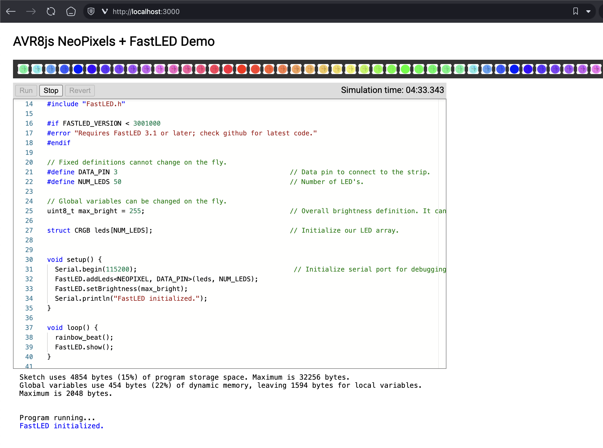

# AVR8js NeoPixels + FastLED Demo

This project demonstrates the use of [avr8js](https://github.com/wokwi/avr8js) library to simulate NeoPixels (ws2812 LEDs) with the [FastLED](https://github.com/FastLED/FastLED) library. You can paste your own Arduino sketch into the editor, and see how it would run on a real AVR microcontroller.

You can find a lot of demo code in the [FastLED-Demos](https://github.com/atuline/FastLED-Demos/tree/master) repository.  
Ready-made sketches can be found in the [demo sketches](./demo_sketches) folder (just copy and paste into code editor and hit `Run` button).

## Getting Started

To run this project, you need to have [Node.js](https://nodejs.org/) and [Yarn](https://yarnpkg.com/) installed on your system.

First, install the project dependencies by running:

```sh
yarn install
```

To start the project, run the following command:

```sh
yarn start
```

It will run a local development server, and you can access the project at [http://localhost:3000/](http://localhost:3000/) (the default port is 3000 unless otherwise configured).

